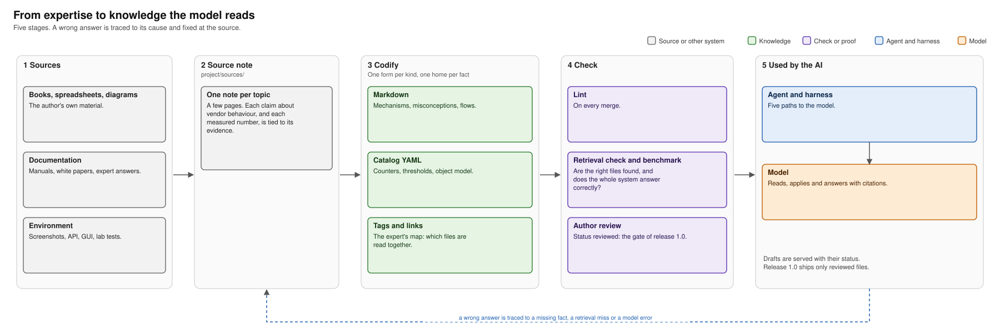
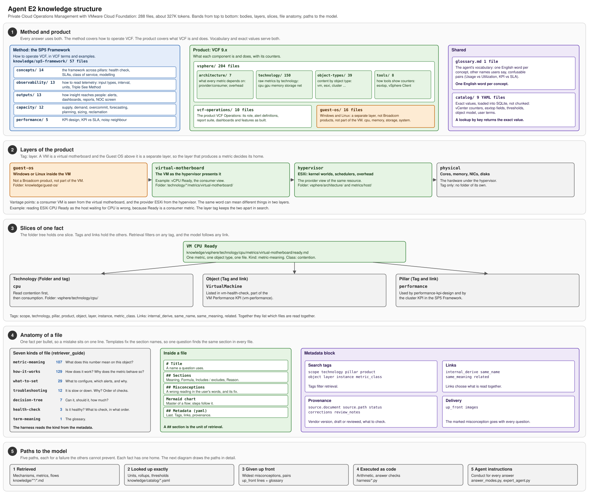
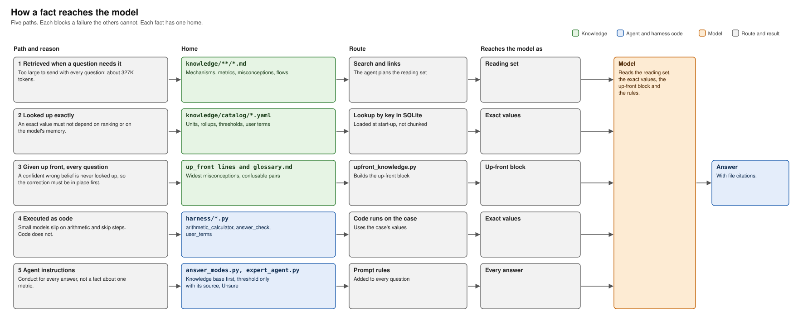
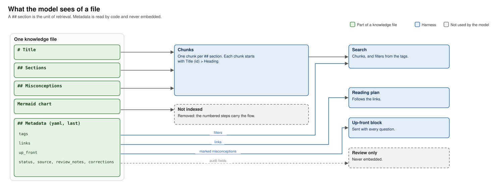
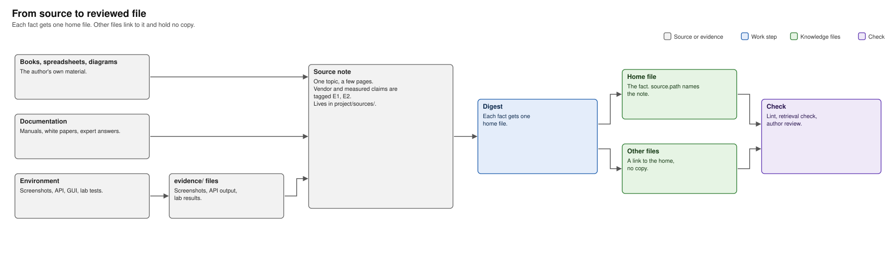

# Knowledge engineering

This document describes the framework to get VMware knowledge codified. How human expertise and experience becomes purpose-built for machine (code + LLM). The output files is not designed for human. It is the design overview for reviewers; the detailed rules for writers are modules in [project/knowledge-rules/](project/knowledge-rules/).

## From expertise to knowledge the model reads



<details>
<summary>Text of the diagram, for readers that cannot see it</summary>

**From expertise to knowledge the model reads.** Five stages. A wrong answer is traced to its cause and fixed at the source.
Colour key: grey = Source or other system; green = Knowledge; purple = Check or proof; blue = Agent and harness; orange = Model.

Boxes, nested as drawn:
- n1 **1  Sources**
  - n2 **Books, spreadsheets, diagrams** (Source or other system): The author's own material.
  - n3 **Documentation** (Source or other system): Manuals, white papers, expert answers.
  - n4 **Environment** (Source or other system): Screenshots, API, GUI, lab tests.
- n5 **2  Source note**: project/sources/
  - n6 **One note per topic** (Source or other system): A few pages. Each claim about vendor behaviour, and each measured number, is tied to its evidence.
- n7 **3  Codify**: One form per kind, one home per fact
  - n8 **Markdown** (Knowledge): Mechanisms, misconceptions, flows.
  - n9 **Catalog YAML** (Knowledge): Counters, thresholds, object model.
  - n10 **Tags and links** (Knowledge): The expert's map: which files are read together.
- n11 **4  Check**
  - n12 **Lint** (Check or proof): On every merge.
  - n13 **Retrieval check and benchmark** (Check or proof): Are the right files found, and does the whole system answer correctly?
  - n14 **Author review** (Check or proof): Status reviewed: the gate of release 1.0.
- n15 **5  Used by the AI**: Drafts are served with their status. | Release 1.0 ships only reviewed files.
  - n16 **Agent and harness** (Agent and harness): Five paths to the model.
  - n17 **Model** (Model): Reads, applies and answers with citations.

Arrows (from, to, label):
- n16 Agent and harness --> n17 Model
- n1 1  Sources --> n5 2  Source note
- n5 2  Source note --> n7 3  Codify
- n7 3  Codify --> n11 4  Check
- n11 4  Check --> n15 5  Used by the AI
- n15 5  Used by the AI ..> n5 2  Source note: a wrong answer is traced to a missing fact, a retrieval miss or a model error

Arrows: `-->` solid, `..>` dashed.

</details>

- Experts hold judgment, not definitions. Each kind of judgment gets its own form: prose for reasons, misconception lines for wrong readings, YAML for exact numbers, and numbered steps for the order of checks.
- Tags and links carry the expert's mental map: which files must be read together.
- Every file passes lint before it is merged. Draft files are served before the author has reviewed them, with their status in the reading set; the on-premises deployment ships only reviewed files ([project/plan.md](project/plan.md), section On-premises deployment). Section 7 says how review progress is tracked.
- The loop closes: every wrong answer is traced back to a missing fact, a retrieval miss or a model error.

| Read | For |
|---|---|
| This file | The design: the problem, where knowledge lives, forms, Level 400 and misconceptions, why the structure is so, workflow, releases and health |
| [placement.md](project/knowledge-rules/placement.md) | Which folder a file goes in; the `knowledge/` tree |
| [flows.md](project/knowledge-rules/flows.md) | Health checks, troubleshooting flows, decision trees: vocabulary, order, step format |
| [metadata.md](project/knowledge-rules/metadata.md) | `retriever_guide` values, every metadata field, the dimensions not to mix |
| [thresholds.md](project/knowledge-rules/thresholds.md) | What a threshold is, the catalog files, one place per number |
| [writing.md](project/knowledge-rules/writing.md) | Writing rules, the author's editing checklist, format choices, images, versions |
| [vocabulary.md](project/knowledge-rules/vocabulary.md) | Words to avoid, each with its replacement and reason |
| [terminology.md](project/knowledge-rules/terminology.md) | Glossary entries, confusable pairs, up-front misconceptions, product labels, budget |
| [project/sources/README.md](project/sources/README.md) | Source notes and their evidence |

## 1. The problem
- Source: the author's books, spreadsheets and field answers, and 20+ years of operating vSphere.
- Most of this knowledge is tacit. It is judgment ("this reading is misleading when…"), not definitions.
- Three readers must use the same knowledge:
  - a small local model, which reads short retrieved passages and follows rules literally;
  - the harness, which needs exact, structured values it can look up and compute with;
  - a human expert, who must be able to review every fact and trace it to its source.
- No single format serves all three, so each kind of knowledge gets its own form. All the forms live in one git repository and are reviewed and versioned together.

### Principles
1. The AI is the reader; humans review. Content is facts, mechanisms, formulas and reasons, with no text aimed at human motivation and no narrative.
2. Mechanism before counter. A metric is a byproduct of the architecture, so a metric file points back to the concepts it follows from.
3. Technology before object. A technology (CPU, memory, storage, network) works across Guest OS, VM, ESXi and cluster. Master how it works first, then apply it to each object.
4. Nuance is explicit. The same name with a different meaning, and the reverse, is stored as links and misconception lines instead of being buried in prose.
5. Vantage points are never mixed: one object type and one layer per metric file (exceptions in section 5). The Guest OS is its own layer and folder.
6. Traceable to source. Every file records its source and heading path. A file digested from a source note names the note, and the note holds the evidence (section 6).
7. Depth before breadth. One complete mechanism beats twenty shallow counter definitions.
8. Measured, not assumed. A structure change is kept only when the retrieval check improves, or holds while the content becomes more correct; the benchmark proves the release ([`benchmark/retrieval-check.md`](benchmark/retrieval-check.md)).

### Limits
- Turning expert judgment into files is lossy, and some tacit knowledge resists codifying.
- The model retrieves and recombines text. Structure improves its answers; it does not create understanding.
- Quality drifts without review. Coverage is partial on purpose, because depth comes first.

## 2. Where the knowledge lives

### What the knowledge is



<details>
<summary>Text of the diagram, for readers that cannot see it</summary>

**Agent E2 knowledge structure.** Knowledge of private cloud operations management with VMware Cloud Foundation: 288 files, about 327K tokens. Bands: method and product, layers, slices of one fact, anatomy of a file, paths to the model.
Colour key: blue = Method (SP5 Framework); green = Product (VMware, hardware); orange = Guest OS; grey = Applies to all.

Boxes, nested as drawn:
- n1 **Method | Product**: 1 | Method explains how private cloud is managed. Product is the knowledge of the IT products involved. Each has supporting files, drawn with a dashed outline.
  - n2 **Method: IT Operations Framework** (Method (SP5 Framework)): The SP5 Framework: how private cloud is managed, with VCF terms and examples. | knowledge/sp5-framework/   57 files
    - n3 **concepts/  14**: the framework across pillars: health check, SLAs, class of service, modelling
    - n4 **observability/  13**: how to read telemetry: input types, interval, units, Triple See Method
    - n5 **outputs/  13**: how insight reaches people: alerts, dashboards, reports, NOC screen
    - n6 **capacity/  12**: supply, demand, overcommit, forecasting, planning, sizing, reclamation
    - n7 **performance/  5**: KPI design, KPI vs SLA, noisy neighbour
    - n8 **glossary.md  1**: supporting file: one English word per concept, other names users say, confusable pairs such as Usage vs Utilization
  - n9 **Product: IT products** (Product (VMware, hardware)): VMware Cloud Foundation, Windows and Linux. Hardware appears as the physical layer under ESXi.
    - n10 **vsphere/   204 files**
      - n11 **architecture/  7** (Product (VMware, hardware)): what every metric depends on: provider/consumer, overhead
      - n12 **technology/  150** (Product (VMware, hardware)): raw metrics by technology: cpu gpu memory storage network
      - n13 **object-types/  39** (Product (VMware, hardware)): content by object type: vm, esxi, cluster ...
      - n14 **tools/  8** (Product (VMware, hardware)): how tools show counters: esxtop, vSphere Client
    - n15 **vcf-operations/   10 files**: The product VCF Operations: its role, alert definitions, report suite, dashboards and features as built.
    - n16 **guest-os/   16 files** (Guest OS): Windows and Linux above the VM: a separate layer, not VMware products. cpu, memory, storage, system.
    - n17 **catalog/   9 YAML files**: supporting files: exact values loaded into SQLite and looked up by key: vCenter counters, esxtop fields, thresholds, object model, user terms.
- n18 **Layers of the product**: 2 | Tag: layer. A VM is a virtual motherboard and the Guest OS above it is a separate layer, so the layer that produces a metric decides its home. | Vantage points: a consumer VM is seen from the virtual motherboard, and the provider ESXi from the hypervisor. The same word can mean different things in two layers. | Example: reading ESXi CPU Ready as the host waiting for CPU is wrong, because Ready is a consumer metric. The layer tag keeps the two apart in search.
  - n19 **guest-os** (Guest OS): Windows or Linux inside the VM Not a Broadcom product, not part of the VM. Folder: knowledge/guest-os/
  - n20 **virtual-motherboard** (Product (VMware, hardware)): The VM as the hypervisor presents it Example: vCPU Ready, the consumer view. Folder: technology/*/metrics/virtual-motherboard/
  - n21 **hypervisor** (Product (VMware, hardware)): ESXi: kernel worlds, schedulers, overhead The provider view of the same resource. Folder: vsphere/architecture/ and metrics/host/
  - n22 **physical** (Product (VMware, hardware)): Cores, memory, NICs, disks The hardware under the hypervisor. Tag only: no folder of its own.
- n23 **Slices of one fact**: 3 | The folder tree holds one slice. Tags and links hold the others. Retrieval filters on any tag, and the model follows any link. | Tags: scope, technology, pillar, product, object, layer, instance, metric_class. Links: internal_derive, same_name, same_meaning, related. Together they list which files are read together.
  - n24 **VM CPU Ready** (Product (VMware, hardware)): knowledge/vsphere/technology/cpu/metrics/virtual-motherboard/ready.md One metric, one object type, one file. Kind: metric-meaning. Class: contention.
  - n25 **Technology   (Folder and tag)** (Product (VMware, hardware)): cpu Read contention first, then consumption. Folder: vsphere/technology/cpu/
  - n26 **Object   (Tag and link)** (Product (VMware, hardware)): VirtualMachine Listed in vm-health-check, part of the VM Performance KPI (vm-performance).
  - n27 **Pillar   (Tag and link)** (Method (SP5 Framework)): performance Used by performance-kpi-design and by the cluster KPI in the SP5 Framework.
- n28 **Anatomy of a file**: 4 | One fact per bullet, so a mistake sits on one line. Templates fix the section names, so one question finds the same section in every file.
  - n29 **Seven kinds of file (retriever_guide)** (Applies to all): metric-meaning 107 What does this number mean on this object? how-it-works 129 How does it work? Why does the metric behave so? what-to-set 29 What to configure, which alerts, and why. troubleshooting 12 It is slow or down. Why? Order of checks. decision-tree 7 Can it, should it, how much? health-check 3 Is it healthy? What to check, in what order. term-meaning 1 The glossary. The harness reads the kind from the metadata.
  - n30 **Inside a file** (Applies to all): A ## section is the unit of retrieval.
    - n31 **# Title**: A name a question uses.
    - n32 **## Sections**: Meaning, Formula, Includes / excludes, Reason.
    - n33 **## Misconceptions**: A wrong reading in the user's words, and its fix.
    - n34 **Mermaid chart**: Master of a flow; steps follow it.
    - n35 **## Metadata (yaml)**: Last. Tags, links, provenance.
  - n36 **Metadata block** (Applies to all)
    - n37 **Search tags**: scope  technology  pillar  product object  layer  instance  metric_class Tags filter retrieval.
    - n38 **Links**: internal_derive  same_name same_meaning  related Links choose what is read together.
    - n39 **Provenance**: source.document  source.path  status corrections  review_notes Vendor version, draft or reviewed, what to check.
    - n40 **Delivery**: up_front  images The marked misconception goes with every question.
- n41 **Paths to the model**: 5 | Five ways knowledge reaches the model: retrieved, looked up, given up front, run as code, set as agent instructions. Each fact has one home.
  - n42 **1  Retrieved** (Applies to all): Mechanisms, metrics, flows knowledge/**/*.md
  - n43 **2  Looked up exactly** (Applies to all): Units, rollups, thresholds knowledge/catalog/*.yaml
  - n44 **3  Given up front** (Applies to all): Widest misconceptions, pairs up_front lines + glossary
  - n45 **4  Executed as code** (Applies to all): Arithmetic, answer checks harness/*.py
  - n46 **5  Agent instructions** (Applies to all): Conduct for every answer answer_modes.py, expert_agent.py

Arrows (from, to, label):
- n19 guest-os --> n20 virtual-motherboard
- n20 virtual-motherboard --> n21 hypervisor
- n21 hypervisor --> n22 physical
- n24 VM CPU Ready --> n25 Technology   (Folder and tag)
- n24 VM CPU Ready --> n26 Object   (Tag and link)
- n24 VM CPU Ready --> n27 Pillar   (Tag and link)

Arrows: `-->` solid, `..>` dashed.

</details>

- Bands 1 to 5: method and product with their supporting files, the layers of the product, the slices of one fact, the anatomy of a file, and the paths to the model (drawn in detail below).
- Method: the SP5 Framework, an IT Operations Framework that explains how private cloud is managed. Product: the IT products involved, VMware Cloud Foundation, Windows and Linux. Every answer uses both. The glossary supports the method and the catalog supports the product.
- A VM is a virtual motherboard and the Guest OS is a separate layer, so the layer that produces a metric decides where it lives.
- The folder tree holds one slice of a fact. Tags and links hold the others.
- One master: the knowledge base. Extraction from the author's books is complete, so new knowledge comes from source notes in [`project/sources/`](project/sources) (section 6). The books and isvara.io are products for people, written by hand or generated; they can drift from the knowledge base, and where they differ the knowledge base wins.
- Source: [`project/tools/knowledge_diagram.py`](project/tools/knowledge_diagram.py) draws the SVG. The file counts in it are typed in: update them from [`project/tools/knowledge_stats.py`](project/tools/knowledge_stats.py) and run the script from the repository root.
- The other diagrams of this document are SVG too, drawn by [`project/tools/document_diagrams.py`](project/tools/document_diagrams.py) with the shared helpers of [`project/tools/diagram_kit.py`](project/tools/diagram_kit.py). Under every SVG image sits a `<details>` block with the text of the diagram: its boxes, nested as drawn, and every arrow with its two ends and its label. [`project/tools/diagram_text.py`](project/tools/diagram_text.py) generates it from the SVG, so a reader of the raw file, Claude included, gets the whole diagram and the two cannot drift. Do not edit a block by hand; lint reports a block that differs from its image.

### How a fact reaches the model

- The home of a fact is decided by how it must reach the model, not by its subject. There are five paths, each for a failure the others cannot prevent:



<details>
<summary>Text of the diagram, for readers that cannot see it</summary>

**How a fact reaches the model.** Five paths. Each blocks a failure the others cannot. Each fact has one home.
Colour key: green = Knowledge; blue = Agent and harness code; orange = Model; grey = Route and result.

Boxes, nested as drawn:
- n1 **1  Retrieved when a question needs it** (Route and result): Too large to send with every question: about 327K tokens.
- n2 **knowledge/**/*.md** (Knowledge): Mechanisms, metrics, misconceptions, flows
- n3 **Search and links** (Route and result): The agent plans the reading set
- n4 **Reading set** (Route and result)
- n5 **Model** (Model): Reads the reading set, the exact values, the up-front block and the rules.
- n6 **2  Looked up exactly** (Route and result): An exact value must not depend on ranking or on the model's memory.
- n7 **knowledge/catalog/*.yaml** (Knowledge): Units, rollups, thresholds, user terms
- n8 **Lookup by key in SQLite** (Route and result): Loaded at start-up, not chunked
- n9 **Exact values** (Route and result)
- n10 **3  Given up front, every question** (Route and result): A confident wrong belief is never looked up, so the correction must be in place first.
- n11 **up_front lines and glossary.md** (Knowledge): Widest misconceptions, confusable pairs
- n12 **upfront_knowledge.py** (Route and result): Builds the up-front block
- n13 **Up-front block** (Route and result)
- n14 **Answer** (Agent and harness code): With file citations.
- n15 **4  Executed as code** (Route and result): Small models slip on arithmetic and skip steps. Code does not.
- n16 **harness/*.py** (Agent and harness code): arithmetic_calculator, answer_check, user_terms
- n17 **Code runs on the case** (Route and result): Uses the case's values
- n18 **Exact values** (Route and result)
- n19 **5  Agent instructions** (Route and result): Conduct for every answer, not a fact about one metric.
- n20 **answer_modes.py, expert_agent.py** (Agent and harness code): Knowledge base first, threshold only with its source, Unsure
- n21 **Prompt rules** (Route and result): Added to every question
- n22 **Every answer** (Route and result)

Arrows (from, to, label):
- n1 1  Retrieved when a question needs it --> n2 knowledge/**/*.md
- n2 knowledge/**/*.md --> n3 Search and links
- n3 Search and links --> n4 Reading set
- n4 Reading set --> n5 Model
- n6 2  Looked up exactly --> n7 knowledge/catalog/*.yaml
- n7 knowledge/catalog/*.yaml --> n8 Lookup by key in SQLite
- n8 Lookup by key in SQLite --> n9 Exact values
- n9 Exact values --> n5 Model
- n10 3  Given up front, every question --> n11 up_front lines and glossary.md
- n11 up_front lines and glossary.md --> n12 upfront_knowledge.py
- n12 upfront_knowledge.py --> n13 Up-front block
- n13 Up-front block --> n5 Model
- n15 4  Executed as code --> n16 harness/*.py
- n16 harness/*.py --> n17 Code runs on the case
- n17 Code runs on the case --> n18 Exact values
- n18 Exact values --> n5 Model
- n19 5  Agent instructions --> n20 answer_modes.py, expert_agent.py
- n20 answer_modes.py, expert_agent.py --> n21 Prompt rules
- n21 Prompt rules --> n22 Every answer
- n22 Every answer --> n5 Model
- n5 Model --> n14 Answer

Notes on the diagram:
- Path and reason
- Home
- Route
- Reaches the model as

Arrows: `-->` solid, `..>` dashed.

</details>

| Path | Holds | Home | Why this path |
|---|---|---|---|
| Retrieved when a question needs it | Mechanisms, metrics, misconceptions, flows | `knowledge/**/*.md` (indexed) | About 320K tokens (November 2026; [`project/tools/knowledge_stats.py`](project/tools/knowledge_stats.py) prints the current figure), too large to send with every question |
| Looked up exactly | Units, rollups, statistics levels, thresholds, user terms | `knowledge/catalog/*.yaml` (loaded into SQLite) | An exact value must not depend on ranking or on the model's memory |
| Given up front, every question | Misconceptions with the widest reach, confusable pairs | Built by [`harness/upfront_knowledge.py`](harness/upfront_knowledge.py) from the `## Misconceptions` lines marked `up_front` in their files and from [`knowledge/glossary.md`](knowledge/glossary.md) | A confident wrong belief is never looked up, so the correction must be in place before the model reasons |
| Executed as code | Arithmetic identities, answer checks, user-word mapping; capacity plans and flow branches (code exists, not yet called by the agent: [`harness/AGENT.md`](harness/AGENT.md), section 4.3) | [`harness/arithmetic_calculator.py`](harness/arithmetic_calculator.py), `answer_check.py`, `user_terms.py`; `capacity_calculator.py`, `flow_executor.py` | Small models slip on arithmetic and skip steps; code does not |
| Agent instructions | Knowledge base first, same-name check, a file for each claim, threshold only with its source, Unsure | [`harness/answer_modes.py`](harness/answer_modes.py) (prompts), [`harness/expert_agent.py`](harness/expert_agent.py) (answer rules) | Conduct for every answer, not a fact about one metric |

- One home per fact. The mechanism lives in `knowledge/`; code and up-front text hold only what they need to act, and point to the file. For example, `arithmetic_calculator.py` converts a summation counter from ms to %, but why Ready is a summation counter is explained in the Ready file. Each up-front misconception ends with `See <id>`.
- Up-front text reaches every answer, while a retrieved file reaches only the answers that find it. A wrong up-front line or prompt rule therefore costs more than a wrong metric file, and it is reviewed first.
- All the domain knowledge the author reviews lives in `knowledge/`, whatever its path to the model. Every knowledge file is indexed, and the up-front block is built from marked lines of those files, so no fact has a second, unindexed copy. `knowledge/` is not the same as chunked prose: the catalog is loaded, not chunked.
- Not deployed: `project/` (lint, allowed tags, moved ids, source notes) and `benchmark/`. They check the knowledge and hold nothing the agent reads.
- Guard: lint rejects hidden text and instruction-like phrases in every knowledge file and benchmark prompt (`injection_patterns` in [`project/tools/rules_check_values.yaml`](project/tools/rules_check_values.yaml)). Knowledge reaches the model as trusted text, so nothing in it may read as an instruction.

### Example: VM CPU Ready on every path
| Path | Where | What it holds |
|---|---|---|
| Retrieved | [`ready`](knowledge/vsphere/technology/cpu/metrics/virtual-motherboard/ready.md) | The mechanism, `internal_derive` to `vcpu-states` and `provider-consumer`, and misconception lines such as "Ready 2% is always low" → read it against Run |
| Looked up | `vcenter-counters.yaml`, row `cpu.ready`; `thresholds-performance.yaml`, row "Peak CPU Ready among any vCPU (%)" | Unit, rollup, statistics level and page; the 20-second limits, with `kb` pointing to the file that explains them |
| Up front | The `provider-consumer` line marked `up_front` | "ESXi CPU Ready is high, so the host waits for CPU" → Ready is a consumer metric |
| Glossary and term map | Entries Readiness and Max Limited; the term-map row for "steal time" | The user's words lead to the Ready file |
| Code | `arithmetic_calculator.summation_to_percent(ms, interval_seconds, vcpus)` | The ms to % conversion, done exactly |
| Instructions | Threshold only with its source | The model quotes the catalog row, not a number from memory |
| Proof | Question 0364 ([`L4-121`](benchmark/questions/L4-121-ready-read-against-run.md)), `knowledge_main: ready` | Option E is the misconception (type `threshold-transplanted`): the higher Readiness is not the worse VM |

## 3. Knowledge forms
| Form | Holds | Home | Why this form |
|---|---|---|---|
| Structured prose | Mechanisms, reasons, edge cases | `knowledge/**/*.md` | Reasons need prose, and one fact per bullet keeps a mistake to one line |
| Misconceptions | Wrong readings and their correction | `## Misconceptions` in each file | The wrong conclusion, in the user's words, retrieves its correction |
| Metadata tags | Kind of file (`retriever_guide`), scope, technology, pillar, product, object, layer, instance, metric class | `## Metadata` yaml ([metadata.md](project/knowledge-rules/metadata.md)) | One file is found from several perspectives; tags filter retrieval |
| Links | Same name, same meaning, derived from, related | `same_name`, `same_meaning`, `internal_derive`, `related` | The expert's mental map: which facts are read together |
| Folder hierarchy | The method (SP5 Framework) and the product (VCF 9.x) kept apart; inside the product, metrics by technology and KPIs by object | `knowledge/` | One tree, in the order the author reviews; links and tags give the other views |
| Catalog | Units, rollups, statistics levels, esxtop fields, thresholds, object model | `knowledge/catalog/*.yaml` → SQLite | Exact values must not depend on retrieval luck |
| Flows | Order of checks: health check, troubleshooting, decision tree | Files with `retriever_guide` health-check, troubleshooting or decision-tree; the Mermaid chart is the master of the structure, the numbered steps follow it (lint checks both agree); placed at the entry point, handing off to another flow at an object or realm boundary | Small models skip steps. Today the reading plan puts the flow first and the model follows its steps; executable steps, where code takes the branch, are still to build (Q-E2-166) |
| Formulas and calculator | Conversions and identities (summation ms ↔ %, KB vs kb) | [`harness/arithmetic_calculator.py`](harness/arithmetic_calculator.py), formulas in files | Arithmetic is where models slip |
| Images with text twins | The author's diagrams and charts | `images/` folders | Search reads words, not pixels: the text twin lets the image be found, and it costs fewer tokens than the image |
| Terminology | Vocabulary, confusable pairs | [`knowledge/glossary.md`](knowledge/glossary.md) | Wrong words produce wrong reasoning (Usage vs Utilization, KPI vs SLA) |
| Provenance | Source and version, what is still to check, status | metadata; evidence in the source note | Every fact can be traced and challenged |
| Rules as code | Architecture and writing rules (project, not deployed) | [`project/tools/rules_check.py`](project/tools/rules_check.py), `rules_check_values.yaml` | A rule that a script checks cannot drift |
| Executable expectations | Expert answers and the misconception a non-expert holds | [`benchmark/questions/`](benchmark/questions) | Shows that the knowledge changes answers |

### What the model sees of a file



<details>
<summary>Text of the diagram, for readers that cannot see it</summary>

**What the model sees of a file.** A ## section is the unit of retrieval. Metadata is read by code and never embedded.
Colour key: green = Part of a knowledge file; blue = Harness; grey = Not used by the model.

Boxes, nested as drawn:
- n1 **One knowledge file**
  - n2 **# Title** (Part of a knowledge file)
  - n3 **## Sections** (Part of a knowledge file)
  - n4 **## Misconceptions** (Part of a knowledge file)
  - n5 **Mermaid chart** (Part of a knowledge file)
  - n6 **## Metadata (yaml, last)** (Part of a knowledge file): tags links up_front status, source, review_notes, corrections
- n7 **Chunks** (Harness): One chunk per ## section. Each chunk starts with Title (id) > Heading.
- n8 **Search** (Harness): Chunks, and filters from the tags.
- n9 **Reading plan** (Harness): Follows the links.
- n10 **Not indexed** (Not used by the model): Removed: the numbered steps carry the flow.
- n11 **Up-front block** (Harness): Sent with every question.
- n12 **Review only** (Not used by the model): Never embedded.

Arrows (from, to, label):
- n2 # Title --> n7 Chunks
- n3 ## Sections --> n7 Chunks
- n4 ## Misconceptions --> n7 Chunks
- n5 Mermaid chart --> n10 Not indexed
- n7 Chunks --> n8 Search
- n6 ## Metadata (yaml, last) --> n8 Search: filters
- n6 ## Metadata (yaml, last) --> n9 Reading plan: links
- n6 ## Metadata (yaml, last) --> n11 Up-front block: marked misconceptions
- n6 ## Metadata (yaml, last) ..> n12 Review only: audit fields

Arrows: `-->` solid, `..>` dashed.

</details>

- A `##` section is the unit of retrieval. A heading names its topic in words a question uses, because the title and heading go in front of every chunk ([`harness/knowledge_loader.py`](harness/knowledge_loader.py)).
- A file link `` [`id`](path.md) `` reaches the model as the id alone; the path is for reviewers on GitHub.
- Section names come from the templates in [`project/templates/`](project/templates) (metric: Meaning, Formula, Includes / excludes, Reason), so the same question finds the same kind of section in every file.

## 4. Misconceptions and Level 400

### Levels
This is the one definition of the levels, and the benchmark uses it ([`benchmark/design.md`](benchmark/design.md), section 3.2).

| Level | Can do | Example (VM CPU Ready) |
|---|---|---|
| 100 | Name the metric. | "Ready is a CPU metric." |
| 200 | Define it. | "Ready is time a vCPU waited for a physical thread." |
| 300 | Use it: read the value, apply a common threshold, follow a runbook. | "Ready above 5% is bad; add capacity." |
| 400 | Explain the mechanism, predict where the reading misleads, and say what to check instead. | "2% Ready on 10% Run delayed 20% of the work; 2% on 98% Run is fine. Ready includes limit time and the summation counter grows with vCPU count, so check Run, Max Limited and the per-vCPU %." |

- The knowledge base is written at Level 400. Levels 100-200 are assumed, and generic models already reach Level 300 from public text.
- What separates 400 from 300 is knowing where a correct number is read wrongly. A Level 300 reader acts on the reading at face value. A Level 400 reader knows the mechanism, and so knows when the reading misleads.

### What a misconception is
- A misconception is a wrong conclusion drawn from a true observation or from a public rule of thumb. The number is right; the reading is wrong.
- It is held with confidence at Level 300: an experienced administrator, a frontier model trained on public text, or the vendor documentation states it.
- It has a mechanism: the knowledge base says why the conclusion fails and what to check instead. A misconception without a mechanism is an opinion, and it does not go in.
- Agent E2 does not set misconceptions for other models to fall into. It beats them by knowing the mechanism behind the number. A misconception is only where that depth becomes visible, because a model that has only Level 300 text repeats it.
- The word is misconception, as in the author's books, and not "trap". In IT infrastructure a trap is an event notification (SNMP trap, a log message an alert traps), and in CPU virtualization it is a hand-over to the hypervisor (trap-and-emulate). The knowledge base uses both meanings, so a third would collide in search.
- Format: one per line, in the `## Misconceptions` section at the end of the file body:

```text
- "<the wrong conclusion, in the words someone would use>" → <the correct reading, the reason, and what to check instead>.
```

- Example: "Swap Consumed = Swap Out - Swap In" → no. Swap Out and Swap In are cumulative totals; Swap Consumed is what sits in swap now, like VM Swapped.

### One home, two paths to the model
- Home: `## Misconceptions` in the file, in the user's own words, next to the mechanism. A question that carries the belief brings in its correction through the reading set.
- Up front: the dozen with the widest reach are marked in their file (metadata `up_front`: the wrong belief, as quoted in the line). [`harness/upfront_knowledge.py`](harness/upfront_knowledge.py) collects the marked lines into the up-front block, so the correction is in place before the model reasons, even when the question does not name the file. There is one copy: the author edits the line in its file.
- Not a confusable pair: two real terms swapped (Core vs Thread Utilization) is a vocabulary error, and it is kept in the glossary. A misconception is a wrong belief about how something works.

### Misconception types
| Type | The reading goes wrong because | Example |
|---|---|---|
| Same name, other object | One label has different meanings on VM, ESXi, cluster | VM CPU Usage vs ESXi CPU Usage |
| Layer confusion | A Guest OS reading is taken as a VM reading, or the reverse | Guest OS run queue called a VM metric |
| Consumption read as contention | Utilization is taken as a performance signal | "Host CPU 90%, so VMs are slow" |
| Average hides the worst | A host or cluster average hides the VM that suffers | "Host Ready is low, so every VM is fine" |
| Rollup and interval | Averaging over 5 minutes or a day removes 20-second peaks | "The 1-week chart shows the peak" |
| Unit and normalization | Summation, per-vCPU vs per-VM, KB vs kb, ms vs % | "Ready of 2,000 ms is high" |
| Frequency and Hyper-Threading | Turbo, power management and HT bend percentages | "Usage above 100% is a data error" |
| Provider vs consumer | A consumer concept is applied to the provider, or the reverse | "Ready applies to ESXi" |
| Cumulative vs current | A running total is read as a current amount | "Swap Consumed = Swap Out - Swap In" |
| Threshold transplanted | A threshold from one layer, product or hardware era is applied elsewhere | "DAVG 10 ms is fine; the docs allow 15 ms" |
| Reclamation read as contention | Balloon, swapped or compressed memory is read as current waiting | "Balloon above 0, so the VM is slow" |
| Tool confusion | vCenter and VCF Operations, or esxtop and vCenter, are treated as the same reading | "Same counter name, so the values match" |
| Label read as model | The label names a different model than the one the product computes | "Total Capacity (GHz) is the host's CPU capacity" |

### Product label and better model (Q-E2-208)
- The product shows a label and computes it with a simple model. The label is reality: the operator reads it on the screen, types it into a question, and acts on what it seems to say. The product is not wrong; it is simpler, because its designer had to fit one number on a summary screen with no one there to explain it. Agent E2 is the one who explains, so it holds both the label and the better model, and never trades one for the other.

| Layer | Example: Total Capacity (CPU) | Example: CPU Usage (MHz) |
|---|---|---|
| Product label, as the UI shows it | Total Capacity, GHz | Usage (MHz) |
| What the product computes | cores × base frequency | productive cycles, scaled by frequency |
| The decision the label invites (Level 300) | "this is how much the host can hold" | "this is how busy the CPU is" |
| The better model and its name | Total Base Capacity (GHz): GHz at base clock; space for vCPUs is counted in physical threads | CPU Throughput: completed work, not busy time |

- The test for a label: the label invites a decision that its computed model does not support, and the knowledge base holds the better model. A label that names what it computes stays a plain metric.
- Never reword a label: quote it as the product shows it, then correct the model behind it. Tone: "the product uses a simpler model", never "the product is wrong".
- Homes: the glossary entry named by the label (Product label, Invites, Better name, File); the metric file keeps the mechanism and a misconception line; a term-map row matches the user's words and carries no note. The list of labels is the set of glossary entries with a `Product label:` line.
- Rules for better names, the five-step teaching order and where each part lives: [`terminology.md`](project/knowledge-rules/terminology.md), Product label entry.

### Use
- Retrieval: a misconception line holds the wrong conclusion in the user's own words, so a question that carries it retrieves the file that corrects it.
- `same_name` links bring in the other object's meaning of the same label. They are the main guard against the first type.
- Benchmark: every multiple-choice question names its misconception option in metadata `misconception`, and its wording in `## Explanation`. The misconception rate, the share of answers that pick it, shows whether a model holds the Level 300 belief.
- A misconception needs a mechanism and a source, like any other fact.

## 5. Structure rationale
- A generic AI fails on vSphere metrics in a known way: it knows the general meaning of a label and applies it where vSphere differs.
- Each structural choice blocks one failure:

| Choice | Failure it blocks |
|---|---|
| Concepts separate from metrics | Answering from a definition without the mechanism behind the value. |
| One object type per metric file | Mixing the VM, ESXi and cluster meanings of the same label. |
| `same_name` / `same_meaning` links | Treating two metrics as equal because the labels match, or as different because the labels differ. |
| One slice in folders, the others in tags and links | A file found from one perspective only. The folder holds technology or object; tags hold pillar, product and object; links hold the rest ([placement.md](project/knowledge-rules/placement.md), Slices). |
| Derived metrics beside their source metrics | Taking a derived VCF Operations metric for a vCenter counter (Contention vs Latency): both sit in the same folder, linked by `same_name` or `internal_derive`. |
| Tool references in `tools/` | Reading esxtop, vCenter and VCF Operations values as the same thing. |
| `retriever_guide` | Retrieving a definition when the question asks what to check or what to set. |
| One topic per file, one fact per bullet, one chunk per `##` section | A retrieved chunk carrying unrelated facts; an error spreading beyond one line. |
| Metadata at the end, parsed separately | Audit text (status, corrections) polluting the embedded content. |
| Method apart from product (SP5 Framework vs vSphere and VCF Operations) | A design rule mistaken for product behaviour, or a product limit mistaken for a rule of the method. |
| A `## Misconceptions` section in every metric file | A true observation read to the wrong conclusion. See section 4. |

- Files are a topic, not a page count: the median is about 600 words, and a concept with many parts (memory tiering, overhead) runs to about 2,800. Size is held by the section, the unit of retrieval, not by the file.
- Two kinds of file carry two object types, on purpose: `comparisons/` files, which set objects side by side, and [`cluster/metrics/availability`](knowledge/vsphere/object-types/cluster/metrics/availability.md), which keeps its ESXi part because the cluster score is built from the host scores, until the availability model after 1.0 ([project/plan.md](project/plan.md), section Knowledge base).
- A complete metric file stays its own file and is not merged into a `comparisons/` file. The reading plan reads a named file whole, so a merged file would load a large file for a question about one counter.
- A file that is not tagged, linked and placed in the right folder is found only by its words, which is why lint checks tags and links. How the agent plans with this structure: [`harness/AGENT.md`](harness/AGENT.md), sections 4.2 and 6.

## 6. Workflow: from source to reviewed file



<details>
<summary>Text of the diagram, for readers that cannot see it</summary>

**From source to reviewed file.** Each fact gets one home file. Other files link to it and hold no copy.
Colour key: grey = Source or evidence; blue = Work step; green = Knowledge files; purple = Check.

Boxes, nested as drawn:
- n1 **Books, spreadsheets, diagrams** (Source or evidence): The author's own material.
- n2 **Source note** (Source or evidence): One topic, a few pages. Vendor and measured claims are tagged E1, E2. Lives in project/sources/.
- n3 **Home file** (Knowledge files): The fact. source.path names the note.
- n4 **Digest** (Work step): Each fact gets one home file.
- n5 **Check** (Check): Lint, retrieval check, author review.
- n6 **Documentation** (Source or evidence): Manuals, white papers, expert answers.
- n7 **Other files** (Knowledge files): A link to the home, no copy.
- n8 **Environment** (Source or evidence): Screenshots, API, GUI, lab tests.
- n9 **evidence/ files** (Source or evidence): Screenshots, API output, lab results.

Arrows (from, to, label):
- n8 Environment --> n9 evidence/ files
- n1 Books, spreadsheets, diagrams --> n2 Source note
- n6 Documentation --> n2 Source note
- n9 evidence/ files --> n2 Source note
- n2 Source note --> n4 Digest
- n4 Digest --> n3 Home file
- n4 Digest --> n7 Other files
- n3 Home file --> n5 Check
- n7 Other files --> n5 Check

Arrows: `-->` solid, `..>` dashed.

</details>

1. Gather. Most of the knowledge (over 80%) comes from the author's books, spreadsheets and diagrams. The rest comes from documentation (manuals, white papers, blogs, expert answers) and from the environment (screenshots, live instances through the API or GUI, lab tests). For a vendor document, use the current version and read its revision date.
2. Write the source note. The author and Claude write one Markdown note per topic, a few pages long, in [`project/sources/`](project/sources). It carries its release and date and an `## Evidence` section. Each claim about vendor behaviour, and each measured number, is tagged with its evidence (`[E1]`). The author's own judgment needs no tag: it is the knowledge base's own source. Format: [project/sources/README.md](project/sources/README.md).
   - Evidence is primary: a vendor document with version, revision and page; a screenshot or API output kept in [`project/sources/evidence/`](project/sources/evidence) with its build; a lab test with its setup. A summary written by a model is not evidence, the note included.
3. Digest. Claude reads the note and proposes which knowledge files and folders to change. Before writing, each fact in the note gets one home file; every other file that needs it gets a link, not a copy. This is where contradictions start: the knowledge base review found 27, mostly answers applied to one file and not to its neighbours (the review is in git history: [project/review-2026-11-15.md at commit 618417b](https://github.com/e1-rahabok/agent-e2/blob/618417bdc8c3c5ee3b31b563ca08bf720774b95b/project/review-2026-11-15.md)).
   - Write each fact in the form that fits it (section 3), and add tags, links and misconceptions.
   - The home file's `source.path` names the note and heading: `project/sources/<note>.md > <heading>`. Lint checks that the note and heading exist and that the note's evidence tags resolve. [`project/tools/source_trace.py`](project/tools/source_trace.py) lists which files each note feeds, from the metadata, so the trace is never kept by hand. When a note changes, those files are rechecked.
   - Files start as `status: draft`.
4. Ask. Every conflict or gap becomes an author question in [`project/author-questions.md`](project/author-questions.md), with a verbatim search string. The answer is applied to the file and the review note is deleted. Extraction continues meanwhile; it does not wait for answers.
5. Check. `python3 project/tools/rules_check.py` must pass before merge (folders, tags, layers, links, images, quotes, tables, phrases, source notes). Unit tests check the tools.
6. Prove. The retrieval check confirms that the right files are found, the benchmark runs the questions against the whole system, and every wrong answer is traced to knowledge, retrieval or model.
7. Review. The author reviews each file, answers `review_notes`, fixes errors and sets `status: reviewed`. Release content is final and curated: every file is reviewed.

## 7. Releases and health

### Releases
- Coverage is vSphere 9.x and VCF 9.x; knowledge of older releases is after 1.0 ([project/plan.md](project/plan.md), After 1.0). The current releases are listed in [`CLAUDE.md`](CLAUDE.md), section Versions.
- A fact that holds only from a release says so in its text ("since VCF Operations 9.1.1"), because the model reads text and metadata is not embedded.
- When Broadcom ships a release:
  1. Read the release notes and the new revision of each vendor document named in `source.document`.
  2. Rewrite each changed fact in its home file and update the version in `source.document`; the files that link to it follow without edits.
  3. When the vendor fixes a document, move the matching `corrections` into the text and clear them.
  4. When a source note is about the changed behaviour, update its release line and evidence first; [`source_trace.py`](project/tools/source_trace.py) lists the files to recheck.
  5. Run the retrieval check; the benchmark questions that cite a changed file are rechecked.

### Health
[`project/tools/knowledge_stats.py`](project/tools/knowledge_stats.py) prints the numbers; [project/plan.md](project/plan.md) records them at each review, so this file holds no figure that goes stale.

| Number | Why it matters |
|---|---|
| Reviewed files | The on-premises deployment needs all of them (plan, section On-premises deployment) |
| Open review notes | Each is a fact still to check |
| Corrections to vendor documents | Each waits for a vendor fix |
| Up-front lines | Each reaches every answer, so it is reviewed first |
| Files no question names | Knowledge the benchmark does not prove |
| Files no other file links to | Found only by their words |
| Source notes cited by no knowledge file | Evidence with no trace to the knowledge |

- Contradictions are found by review, not by a script: the question bank audit and the knowledge review list them ([project/plan.md](project/plan.md), section Knowledge base). The digest step (section 6, step 3) prevents new ones.
