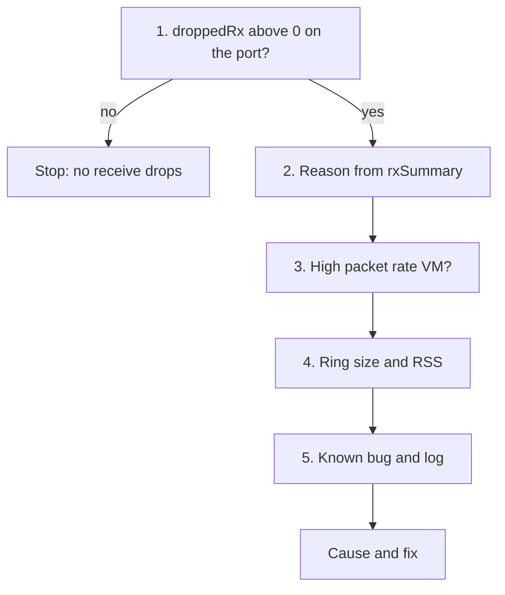

# vNIC receive drops

## Symptom
- Receive drops on a VM vNIC: droppedRx above 0 on its port, packet loss reported inside the Guest OS, or a network VM (firewall, router) losing traffic.
- The VM KPI scores transmit drops; receive drops on a VMXNET3 ring are caused and fixed in the Guest OS driver, so they are the Guest OS owner's to fix ([`sp5-framework/concepts/realms-and-layers`](../../../sp5-framework/concepts/realms-and-layers.md), section Consumer and provider metric types).

## Flow

```mermaid
flowchart TD
  S1[1. droppedRx above 0 on the port?] -->|no| E1[Stop: no receive drops]
  S1 -->|yes| S2[2. Reason from rxSummary]
  S2 --> S3[3. High packet rate VM?]
  S3 --> S4[4. Ring size and RSS]
  S4 --> S5[5. Known bug and log]
  S5 --> E5[Cause and fix]
```

## Checks, in order
1. Port statistics for the vNIC port (VirtualMachine, HostSystem) ([`vsphere/technology/network/metrics/virtual-motherboard/packets-dropped`](metrics/virtual-motherboard/packets-dropped.md)):
```text
vsish -e get /net/portsets/DvsPortset-0/ports/<port>/clientStats
```
   - droppedRx above 0 confirms receive drops (example: 2,620) → step 2. 0 → stop.
2. Reason, from the vmxnet3 receive queue summary (VirtualMachine):
```text
vsish -e get /net/portsets/DvsPortset-0/ports/<port>/vmxnet3/rxSummary
```
   - running out of buffers: matches the drop count (example: 2,620).
   - # of times the 1st ring is full: example 354.
   - 1st ring size and 2nd ring size: example 512 each.
   - Other reasons (fail to map, rx queue stopped, copy failures, large headers, MTU exceeded) at 0 rule them out. → step 3.
3. Consumption (VirtualMachine). Network VMs (firewalls, routers) or VMs expecting high packet rates ([`vsphere/technology/network/metrics/virtual-motherboard/packets`](metrics/virtual-motherboard/packets.md)). → step 4.
4. Configuration (VirtualMachine). Receive ring size in the Guest OS driver; whether the VM requests NetQ RSS ([`vsphere/technology/network/configuration/rss-and-interrupt-coalescing`](configuration/rss-and-interrupt-coalescing.md)). → step 5.
5. Known bug and log (VirtualMachine, HostSystem). VMXNET3 can lose packets in very high bursts when buffers run out (KB 2039495); events in the window ([`sp5-framework/performance/vm-slow`](../../../sp5-framework/performance/vm-slow.md), its known bug and log checks).

## Order rationale
- Confirm the drops at the port first: Guest OS loss can come from elsewhere in the path.
- The reason before any change: only rxSummary tells a full ring from the other causes.
- Packet rate before ring size: a larger ring helps a burst, not a VM that is short of vCPU to drain it.

## Interpretation
- Drops = running out of buffers and ring full: the receive ring is too small. A ring of 2K instead of 512 is a field suggestion.
- Network VMs (firewalls, routers) or VMs expecting high packet rates: check whether the VM requests NetQ RSS.
- VMXNET3 can lose packets in very high bursts when buffers run out (KB 2039495).

## Single receive queue
- A VMXNET3 adapter with one receive queue has all its receive interrupts processed by one vCPU. That vCPU can saturate while the VM's other vCPUs idle, and the ring fills because it is not drained (Broadcom KB 440347).
- Symptoms of a single receive queue: running out of buffers and # of times the 1st ring is full rise in rxSummary; moving the VM to another host does not help (Broadcom KB 440347).
- Raising the VMXNET3 receive rings to their maximum does not stop drops caused by a single receive queue: a larger ring absorbs a burst, it does not drain faster (Broadcom KB 440347).
- The fix is Receive Side Scaling (RSS) in the Guest OS, with several receive queues spread over the vCPUs. Windows: VMXNET3 adapter Properties, Advanced tab, Maximum Number of RSS queues. Linux: the vmxnet3 driver parameter `num_rqs` (Broadcom KB 440347).
- The number of receive queues a VM can use is capped by its vCPU count: a 4-vCPU VM uses at most 4 (Broadcom KB 440347).
- Check the active queues on the host: `vsish -e ls /net/portsets/<switch>/ports/<port>/vmxnet3/rxqueues/` lists one directory per queue (Broadcom KB 440347).
- Guest RSS spreads receive work over vCPUs inside the VM. Host-side RSS on the physical NIC is a separate setting ([`vsphere/technology/network/configuration/rss-and-interrupt-coalescing`](configuration/rss-and-interrupt-coalescing.md)).

## Misconceptions
- "vSphere shows the drop reason" → only vsish shows it.
- "The largest receive ring fixes every receive drop" → with one receive queue, one vCPU drains the ring; turn on RSS in the guest instead.
- "Configure more receive queues than vCPUs for headroom" → the queues a VM can use are capped by its vCPU count.
- "Receive drops on the vNIC are the network team's problem" → a full VMXNET3 ring is caused and fixed in the Guest OS driver.

## Metadata
```yaml
id: vsphere/technology/network/vnic-rx-drops
retriever_guide: troubleshooting
scope: vsphere
technology:
- network
pillar:
- performance
product:
- vsphere
object:
- VirtualMachine
- HostSystem
internal_derive:
- vsphere/technology/network/metrics/virtual-motherboard/packets-dropped
- vsphere/technology/network/metrics/virtual-motherboard/packets
- vsphere/technology/network/configuration/rss-and-interrupt-coalescing
- sp5-framework/performance/vm-slow
related:
- vsphere/technology/network/metrics/host/packets-dropped
- sp5-framework/performance/performance-management
source:
  document: Knowledge base; Broadcom KB 440347 (Mitigating VMXNET3 adapter packet drops due to single receive queue)
  path: 'Network > ESXi > Contention Metrics > Dropped Packet > vsish; section Single receive queue from Broadcom KB 440347'
corrections: []
review_notes:
- 'Section ''Single receive queue'': Broadcom KB 440347 names no ESXi version; check against the vSphere 9.1 documentation. https://knowledge.broadcom.com/external/article/440347'
status: draft
```
